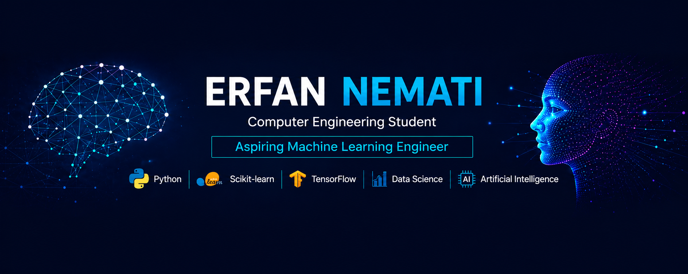

<h1 align="center">Hi 👋, I'm Erfan</h1>
<h3 align="center">Machine Learning Enthusiast | Exploring AI, Data Science, and Deep Learning from Iran</h3>

  

- 🔭 I’m currently working on [Building ML projects with Python, Scikit-learn, and data analysis workflows.](https://github.com/Erfan-Nemati)

- 🌱 I’m currently learning **Deep Learning, TensorFlow, Computer Vision, NLP**

- 👯 I’m looking to collaborate on **Interested in collaborating on beginner-friendly ML, Data Science, and AI projects.**

- 🤝 I’m looking for help with **Improving my knowledge of TensorFlow, model deployment, and production ML workflows.**

- 👨‍💻 All of my projects are available at [https://github.com/Erfan-Nemati](https://github.com/Erfan-Nemati)

- 💬 Ask me about **I have hands-on experience building ML models, preprocessing data, performing EDA, and evaluating models.**

- 📫 How to reach me **Erfan.Nemati.dev@gmail.com**

<h3 align="left">Connect with me:</h3>

<h3 align="left">Languages and Tools:</h3>

          

&nbsp;

